# 🏗️ ArqLeads - Architecture Documentation

## System Overview

ArqLeads es un sistema de captación automatizada de leads para estudios de arquitectura, que utiliza IA conversacional para calificar leads en tiempo real.

## 📐 High-Level Architecture

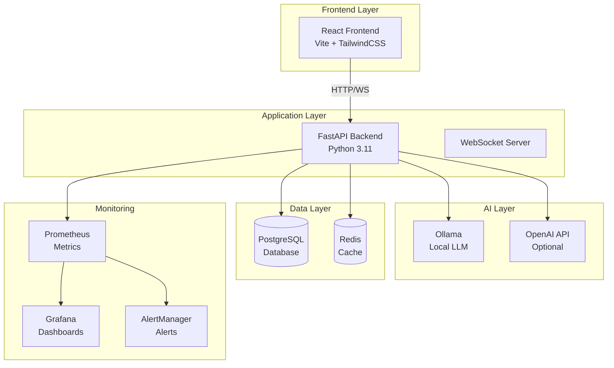

## 🔄 Request Flow

### Chat Message Flow

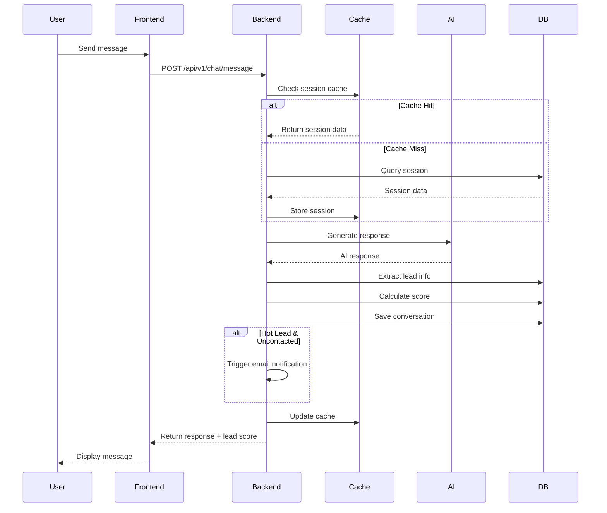

### Admin Dashboard Flow

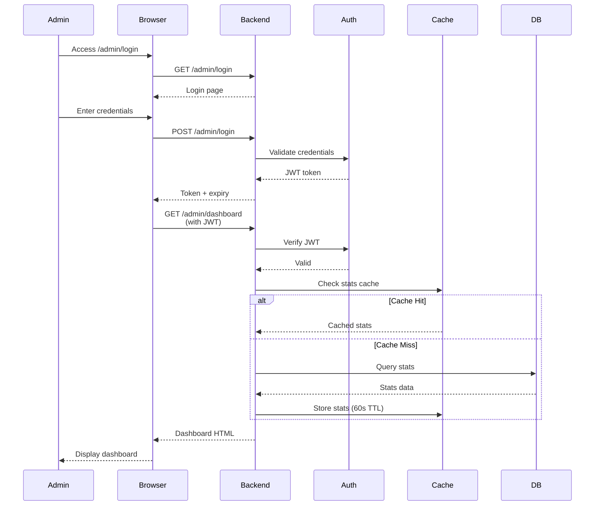

## 📊 Data Model

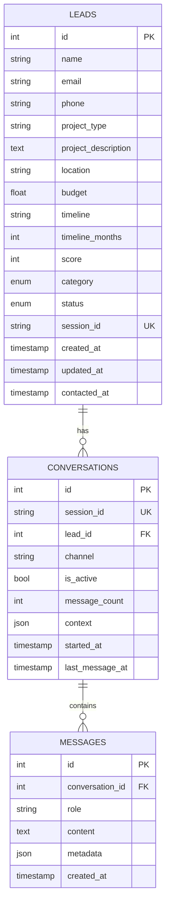

## 🔐 Security Architecture

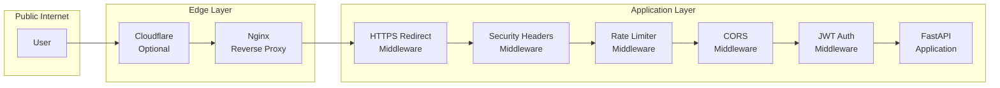

## 🚀 Deployment Architecture

### Development

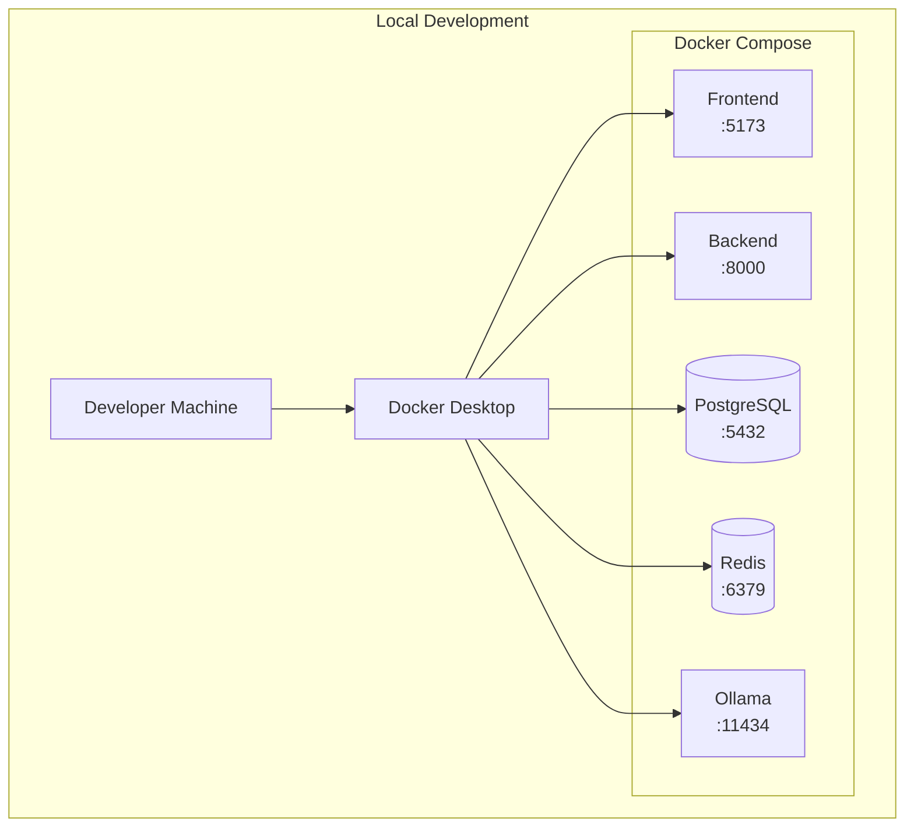

### Production

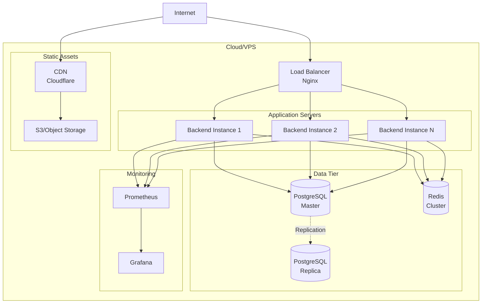

## 🔄 CI/CD Pipeline

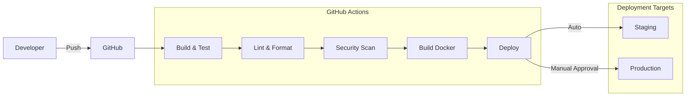

## 📈 Monitoring & Observability

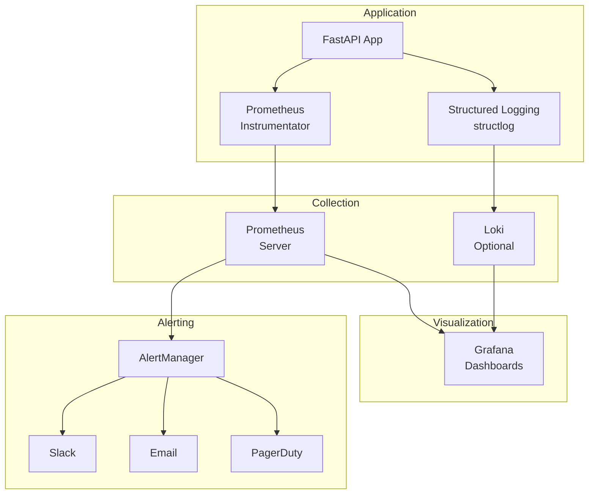

## 🧩 Component Details

### Backend Components

```mermaid
graph TB
    subgraph "FastAPI Application"
        MAIN[main.py<br/>App Entry]

        subgraph "API Routes"
            CHAT[/api/v1/chat]
            LEADS[/api/v1/leads]
            ADMIN[/admin]
        end

        subgraph "Core Services"
            AI[AI Service<br/>Ollama/OpenAI]
            EMAIL[Email Service<br/>SMTP]
            CACHE[Cache Service<br/>Redis]
        end

        subgraph "Middleware"
            RATE[Rate Limiting]
            SEC[Security Headers]
            LOG[Request Logging]
        end

        subgraph "Database"
            ORM[SQLAlchemy ORM]
            MODELS[Models]
        end

        MAIN --> CHAT
        MAIN --> LEADS
        MAIN --> ADMIN

        CHAT --> AI
        LEADS --> CACHE
        ADMIN --> EMAIL

        MAIN --> RATE
        MAIN --> SEC
        MAIN --> LOG

        CHAT --> ORM
        LEADS --> ORM
        ORM --> MODELS
    end
```

### Cache Strategy

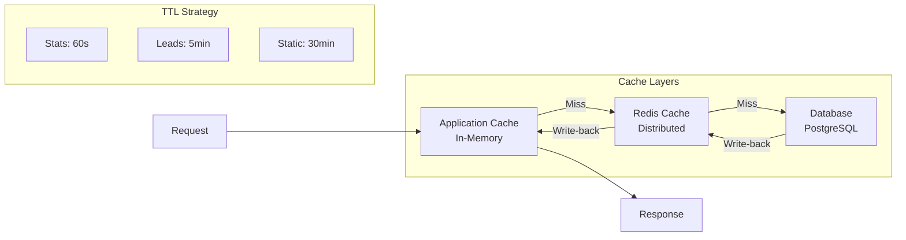

## 🎯 Scaling Strategy

### Horizontal Scaling

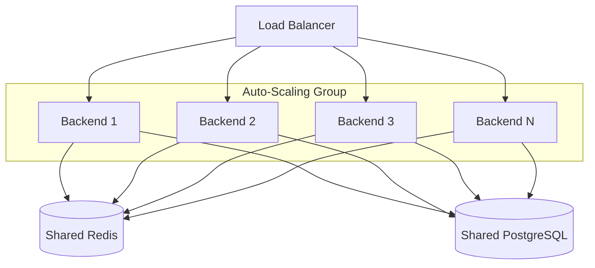

### Database Scaling

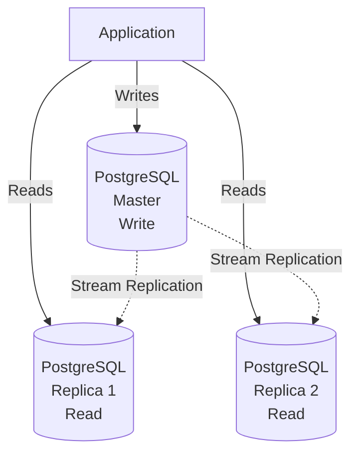

## 🔒 Security Layers

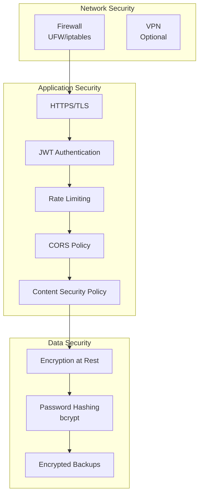

## 📝 Technology Stack

### Backend
- **Framework**: FastAPI 0.109+
- **Language**: Python 3.11+
- **ORM**: SQLAlchemy 2.0
- **Validation**: Pydantic 2.5+
- **AI**: Ollama (local) / OpenAI (cloud)
- **Cache**: Redis 7.0+
- **Database**: PostgreSQL 15+

### Frontend
- **Framework**: React 19+
- **Build Tool**: Vite 7+
- **Styling**: TailwindCSS 4+
- **HTTP Client**: Axios
- **Icons**: Lucide React

### DevOps
- **Containerization**: Docker + Docker Compose
- **Monitoring**: Prometheus + Grafana
- **Logging**: structlog
- **CI/CD**: GitHub Actions
- **Testing**: Pytest, Vitest, Playwright

## 📊 Performance Targets

| Metric | Target | Critical |
|--------|--------|----------|
| API Response Time (p95) | <500ms | <1000ms |
| Chat Response Time | <2s | <5s |
| Database Query Time | <50ms | <200ms |
| Cache Hit Rate | >95% | >80% |
| Uptime | >99.5% | >99% |
| Error Rate | <0.1% | <1% |

## 🔍 Monitoring Metrics

### Application Metrics
- `http_requests_total` - Total HTTP requests
- `http_request_duration_seconds` - Request duration histogram
- `http_requests_in_progress` - Current requests
- `database_connections_active` - Active DB connections
- `cache_hit_rate` - Cache hit percentage
- `leads_created_total` - Total leads created
- `leads_by_category` - Leads by hot/warm/cold

### Infrastructure Metrics
- CPU usage
- Memory usage
- Disk I/O
- Network throughput
- Container health

---

**Version**: 1.0.0
**Last Updated**: $(date +%Y-%m-%d)
**Maintained by**: DevOps Team
